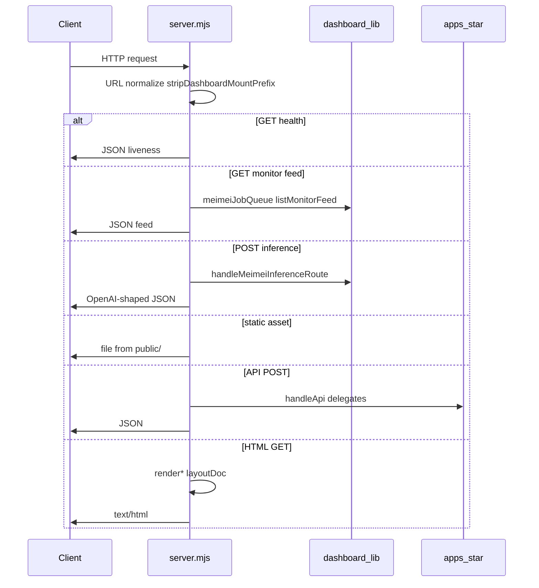

# MeiMei kernel — code audit (v1)

**Status:** living document — refresh when kernel extraction (K1–K2) or allowlist changes.  
**Package baseline:** `agent-meimei` **0.8.8** (audit run **2026-03-30**).  
**Companion docs:** [meimei-kernel-completion-plan.v1.md](meimei-kernel-completion-plan.v1.md), [meimei-repo-boundaries.v1.md](meimei-repo-boundaries.v1.md), [../compliance/ai-runtime-audit.md](../compliance/ai-runtime-audit.md), [../developers/meimei-kernel-handbook.v1.md](../developers/meimei-kernel-handbook.v1.md).

---

## 1. Executive summary

The **MeiMei kernel** is a **documented architectural boundary**, not a separate npm package: HTTP entry in [`dashboard/server.mjs`](../../dashboard/server.mjs), shared modules under [`dashboard/lib/*`](../../dashboard/lib), operator env store, SQLite job spooler + in-process worker, and the OpenAI-shaped inference router to Ollama. Product behavior lives in [`apps/*`](../../apps) and HTML shells in [`dashboard/lib/platform-pages/*`](../../dashboard/lib/platform-pages).

| Area | Assessment |
|------|------------|
| **Boundary clarity** | Strong — [meimei-repo-boundaries.v1.md](meimei-repo-boundaries.v1.md) + `npm run boundary:check`. |
| **`server.mjs` size** | **~3840 lines** — still the gravity well; many `render*` names remain but several are **thin delegates** to `platform-pages/*` (see §3). |
| **Inference plane** | **Stable contract** — [`docs/api/inference-route.v1.md`](../api/inference-route.v1.md) matches [`dashboard/lib/inference-route.mjs`](../../dashboard/lib/inference-route.mjs). |
| **Job plane** | **Stable** — SQLite `meimei_jobs`, worker claims `inference_v1` only; `app_task` for sovereign adapters — [adapter-contract.v1.md](adapter-contract.v1.md). |
| **AI honesty** | Product surfaces mix **Ollama**, **OpenClaw**, rules, and stubs — kernel docs must align with [ai-runtime-audit.md](../compliance/ai-runtime-audit.md). |
| **Inline documentation** | **Uneven** — strong in boundary modules and many `dashboard/lib` files; **no** file-top module story in `server.mjs` (§8). |

---

## 2. Kernel inventory vs documentation

### 2.1 Kernel responsibilities ([meimei-kernel-completion-plan.v1.md](meimei-kernel-completion-plan.v1.md) §1.1)

| Documented area | Primary implementation | Verified in code |
|-----------------|------------------------|------------------|
| HTTP entry + route table | `dashboard/server.mjs` | `http.createServer` ~L2829; `server.listen` ~L3836 |
| Surface + static config | `dashboard/lib/dashboard-surface.mjs`, `config/*` | Imported at top of `server.mjs` |
| Registry + runtime helpers | `miniapp-registry.mjs`, `runtime.mjs` | Loaded sync; `routeToApp` / catalog builders |
| Env SoT | `meimei-env-store.mjs` | JSON store under `data/meimei-environment.v1.json` + catalog |
| Jobs + worker + inference | `meimei-job-queue.mjs`, `meimei-job-worker.mjs`, `inference-route.mjs` | `startMeimeiJobWorker` + `handleMeimeiInferenceRoute` wired from `server.mjs` |
| Monitor feed | `meimei-monitor-feed.mjs` | `GET` `/api/meimei/monitor/feed` ~L3599 |
| Design system delivery | `public/styles/*` | Static prefix handling ~L3667+ |

### 2.2 Allowlist reconciliation ([meimei-repo-boundaries.v1.md](meimei-repo-boundaries.v1.md) §3)

The boundaries doc lists explicit **`dashboard/lib/*`** files as core or integration-adjacent. **CI** runs:

- [`scripts/meimei-repo-boundaries-check.mjs`](../../scripts/meimei-repo-boundaries-check.mjs)
- [`scripts/meimei-apps-cross-import-check.mjs`](../../scripts/meimei-apps-cross-import-check.mjs)

**Full `npm run ci`** ([`package.json`](../../package.json)): `boundary:check`, `registry:validate`, `policy:validate`, `audit:validate`, `telemetry:validate`, `handoff:validate`, `adapter:whatsapp:validate`, `imessage:validate`, `release:gates`.

No drift was detected between this audit’s kernel table and the **intent** of §3; filename moves should trigger a **v1 bump** per boundaries doc §Versioning.

---

## 3. `dashboard/server.mjs` quantification (kernel debt)

| Metric | Value (2026-03-30) |
|--------|---------------------|
| Total lines | **3840** (`wc -l`) |
| `function render*` declarations | **35** |

### 3.1 Thin wrappers (delegate to `platform-pages/*`)

Examples — inbox / memory / mission control shells (K1a):

- `renderInboxPage` → `renderInboxPageOps(layoutDoc, opsToolPageDeps())`
- Lead enrichment / outreach (K1b): `renderLeadEnrichmentPage` → `renderLeadEnrichmentPageGtm(layoutDoc, gtmPageDeps())` (and settings + outreach siblings)
- `renderReferenceApp1Page` / `renderReferenceApp2Page` → `*Platform(..., referenceAppPageDeps())`
- `renderSystemMonitorPage` → `renderSystemMonitorPagePlatform(...)`
- Catalog-style: `renderRoutingPage`, `renderApiChannelAdapterPage`, `renderAiSdrAnalyticsPage`, `renderSupabaseConnectorPage`, `renderEnvironmentVariablesPage` (tool surface batch)

These satisfy the **spirit** of “thin server” for those surfaces even though the **`function render*` names** still exist in `server.mjs`.

### 3.2 Remaining large inline HTML / settings

At least **What next? settings** (`renderWhatNextSettingsPage` ~L2205+) still contains **large inline HTML** in `server.mjs`. Other pages (URL summary, daily briefing, explain-it settings, AI routing settings, API access settings, admin, shared chrome) remain as documented in kernel completion plan **K1c–K1e** / **K2**.

**Exit criterion (K1):** `grep '^function render' dashboard/server.mjs` shows only wrappers + explicitly retained shared helpers — **not yet met** for all surfaces.

---

## 4. Request lifecycle (HTTP)

1. **Listen** — Host/port from dashboard surface config + [`config/dashboard-listen-normalize.mjs`](../../config/dashboard-listen-normalize.mjs).
2. **Normalize path** — `stripDashboardMountPrefix` for reverse-proxy mounts.
3. **Branch** — Order matters: health, monitor feed, **`POST /api/meimei/route`**, checklist proxy, static files, JSON APIs, then HTML routes with `render*` + layout merge.

**Delegate pattern:** POST bodies parsed once; miniapp handlers imported as `handleApi` from `apps/<id>/index.mjs` (see imports ~L65–L76 region and extended list in file).

---

## 5. Inference route lifecycle

| Step | Code / contract |
|------|-------------------|
| Entry | `POST` path constant `meimeiInferenceRoute` = `/api/meimei/route` |
| Trace ID | Header `x-meimei-trace-id` wins over `body.meimei.traceId`, else UUID |
| Handler | [`handleMeimeiInferenceRoute`](../../dashboard/lib/inference-route.mjs) |
| Model resolution | Explicit Ollama id or `router-auto` + `meimei.taskCategory` → `TASK_CATEGORY_TO_MODEL` |
| Runner | `fetch` to `OLLAMA_HOST` + `/v1/chat/completions` (OpenAI-compatible) |
| Guards | `stream: true` → **501**; `meimei.localOnly: false` → **501**; empty `messages` → **400**; estimated tokens > `MEIMEI_INFERENCE_MAX_CONTEXT` / default **8192** → **413** |
| Success | `200` + `choices`, `usage`, `meimei_meta` (`backend_used: ollama`, latency, trace_id) |

Authoritative spec: [inference-route.v1.md](../api/inference-route.v1.md).

---

## 6. Job queue and worker lifecycle

| Concern | Detail |
|---------|--------|
| Storage | SQLite `data/meimei/meimei-jobs.sqlite`, WAL + `busy_timeout` |
| Schema | `meimei_jobs`: `trace_id`, `adapter_name`, `direction` (`ingress`/`egress`), `payload` (JSON), `status` (`pending`/`processing`/`completed`/`failed`), retries, `payload_kind`, `target_adapter`, `source_adapter` |
| Routing meta | [`deriveRoutingMeta`](../../dashboard/lib/meimei-job-queue.mjs) — `inference_v1` vs `app_task` |
| Worker | [`startMeimeiJobWorker`](../../dashboard/lib/meimei-job-worker.mjs) — **`claimNextInferencePending`** only; runs `handleMeimeiInferenceRoute` on payload; **correlation** may enqueue `app_task` replies; large assistant text → **Claim Check** spill under `data/meimei/artifacts/<trace>/digest.md` |
| Disable | `MEIMEI_JOB_WORKER=0` |

Contract: [adapter-contract.v1.md](adapter-contract.v1.md).

---

## 7. Registry lifecycle

| Artifact | Role |
|----------|------|
| [`functions/registry.v1.json`](../../functions/registry.v1.json) | SSOT for ids, display names, routes, API paths |
| [`dashboard/lib/miniapp-registry.mjs`](../../dashboard/lib/miniapp-registry.mjs) | Parse contract routes, build catalog maps, `serverApiPath` for local server |
| [`functions/*.md`](../../functions) | Human + machine function specs |

**Rule:** Core **must not** import `apps/*` from other apps; cross-app flows use documented bus / queue patterns.

---

## 8. Kernel-focused AI / LLM truth table

This table describes **kernel-owned or kernel-adjacent** paths only. Full product inventory: [ai-runtime-audit.md](../compliance/ai-runtime-audit.md).

| Component | Model / intelligence class | Dependency |
|-----------|----------------------------|------------|
| [`inference-route.mjs`](../../dashboard/lib/inference-route.mjs) | **Ollama** (OpenAI-compatible HTTP) | `OLLAMA_HOST` (default `127.0.0.1:11434`) |
| [`meimei-job-worker.mjs`](../../dashboard/lib/meimei-job-worker.mjs) (inference jobs) | Same as inference route | Ollama up |
| [`llm.mjs`](../../dashboard/lib/llm.mjs) | **Ollama** — `callOllama`, `callOllamaJson`, cache, routing config helpers | Used by many **apps** and legacy hot paths; **not** the same code path as OpenClaw agent turns |
| OpenClaw agent turns | **Separate backend** (CLI / gateway config) | `openclaw` on `PATH`; **not** unified with `inference-route` v1 |

**Implication for external integrators:** Calling **`POST /api/meimei/route`** gives a **deterministic, documented** local inference contract. Features that shell out to **`oc-agent`** or use **stub/sample** data are **out of band** for that contract — see compliance audit.

---

## 9. Security, configuration, and operations

| Topic | Notes |
|-------|-------|
| **Env store** | [`meimei-env-store.mjs`](../../dashboard/lib/meimei-env-store.mjs) — persisted secrets/config JSON; optional strict key naming (`MEIMEI_ENV_STRICT_KEY_NAMES`); catalog in `config/meimei-env-catalog.v1.json` |
| **Threat model** | Dashboard is designed as **operator-local** control plane; do not expose raw dashboard to untrusted networks without TLS and auth (see deployment docs). |
| **Readiness** | `./scripts/oc-readiness` and related ops scripts — OpenClaw/Ollama health expectations |
| **Inference env** | `MEIMEI_INFERENCE_MAX_CONTEXT`, `OLLAMA_HOST` |

---

## 10. Gap analysis vs kernel completion plan (K1–K4)

| Phase | Theme | Audit finding |
|-------|--------|----------------|
| **K1** | GET/settings extraction | **Partial** — reference apps, system monitor, ops tools (K1a), **GTM** (K1b → `gtm-pages.mjs`), tool surfaces extracted; **large** `server.mjs` blocks remain (what-next settings, reader pages, routing settings, admin/chrome). |
| **K2** | Shared chrome module | **Open** — `renderPage`, `renderGlobalNav`, `renderList`, `renderFlashcard` still in `server.mjs`. |
| **K3** | LLM + queue alignment (R1/R2) | **Ongoing** — migrate Yellow paths per roadmap; inference route is the preferred **blocking** API for adapters. |
| **K4** | Trace polish, smoke gates | Per roadmap — `trace_id` propagation and CI smoke policies. |

---

## 11. Comment and documentation quality audit

### 11.1 Automated heuristics (`.mjs`)

Method: **file-top** module banner = first non-whitespace starts with `/**`; `@param` = any occurrence in file.

| Scope | Files | File-top `/**` banner | Any `@param` |
|-------|-------|------------------------|--------------|
| `dashboard/lib/**/*.mjs` | 48 | **30** (62.5%) | **25** (52.1%) |
| `apps/**/*.mjs` | 12 | **12** (100%) | **1** (8.3%) |
| `dashboard/server.mjs` | 1 | **0** | **0** |

### 11.2 Qualitative notes

- **Strong:** [`inference-route.mjs`](../../dashboard/lib/inference-route.mjs) (contract link + JSDoc), [`miniapp-registry.mjs`](../../dashboard/lib/miniapp-registry.mjs) (SSOT warning), checklist / bridge modules, [`scripts/meimei-repo-boundaries-check.mjs`](../../scripts/meimei-repo-boundaries-check.mjs).
- **Section-style:** [`llm.mjs`](../../dashboard/lib/llm.mjs) — `//` banners, few structural `@param` blocks at file level.
- **Sparse module scope:** [`runtime.mjs`](../../dashboard/lib/runtime.mjs), [`meimei-env-store.mjs`](../../dashboard/lib/meimei-env-store.mjs) — export-level comments exist but no unified file header.
- **Server:** Large **mid-file** `/**` blocks cluster routes; **no** top-level architectural overview at line 1.
- **TODO/FIXME:** Effectively **absent** in first-party `.mjs` (search shows no routine debt markers — track debt in issues or roadmap instead).

### 11.3 Standards for new kernel modules (recommended)

1. Start with a **`/** … */` module block**: purpose, primary contract link (`docs/api` or `docs/architecture`), package alignment tag if integration-critical.
2. **Exported** async functions: `@param` / `@returns` for non-obvious shapes.
3. **Do not** duplicate registry strings — use `miniapp-registry` + `registry.v1.json`.
4. **Server changes:** prefer **one-line** delegates to `platform-pages/*` or `apps/*` over new 200-line HTML blocks.

---

## 12. Revision log

| Date | Notes |
|------|-------|
| 2026-03-30 | Initial v1 audit + comment metrics + lifecycle diagrams. |
