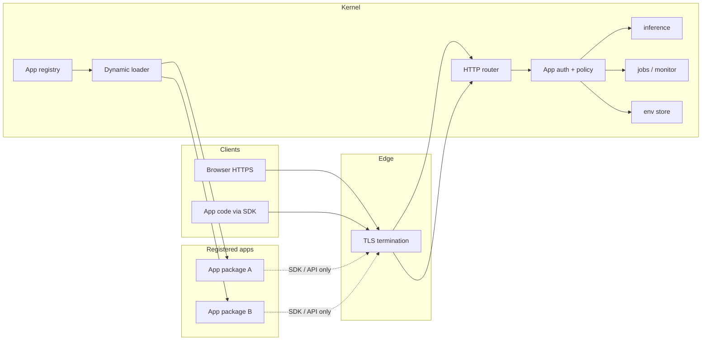

# Program: Kernel / app separation + HTTPS-only surface

**Version:** v1  
**Date:** 2026-03-29  
**Owner:** Platform / architecture  
**Status:** Planning — **MM-KERNEL-201**–**203** delivered; **MM-KERNEL-501** **partial** (opt-in `MEIMEI_KERNEL_EXTERNAL_APPS=1` POST dispatch + selftest); catalog/GET shells (**MM-KERNEL-502**), policy/SDK (**MM-KERNEL-301+**), static-import removal (**MM-KERNEL-603**) open

## Executive summary

Decouple MeiMei **applications** from the **kernel** so each app can live in its own directory (and eventually its own repository), register by path with a kernel-issued **`app_id`**, and consume shared services only through a **MeiMei API/SDK** with **per-app policy** (capabilities, priority, rate limits). In parallel, make **HTTPS** the only supported client-facing transport, including localhost.

**v1 scope decision (locked):** [ADR-001](../architecture/adr/ADR-001-app-runtime-v1.md) — operator-only, same-machine install; **in-process dynamic load** as default; sidecars deferred.

---

## Program taxonomy

| Dimension | Values |
|-----------|--------|
| **Themes** | T1 Transport (HTTPS), T2 Identity & registry, T3 Capability API & policy, T4 Loader & runtime, T5 Migration & deprecation, T6 Governance & ops |
| **Issue types** | ADR, Epic, Story, Task, Spike |
| **Suggested GitHub labels** | `area:kernel`, `area:apps`, `area:security`, `area:ops`, `priority:P0–P2`, `type:adr`, `type:feature`, `type:chore`, `blocked-by:adr-001` |
| **Non-goals (v1)** | Public third-party app marketplace; multi-tenant billing; remote app hosts (see ADR-001) |

## System map (target)



## Business layer mapping

| Business need | Technical carrier |
|---------------|-------------------|
| Independent app teams & repos | Manifest + install path; no static kernel import |
| Discoverable platform surface | Registry + catalog merge |
| Fair shared AI/queue usage | Policy: priority, concurrency, rate limits |
| Audit & compliance | `app_id` on logs, monitor rows, job metadata |
| Trusted local product | HTTPS + operator-only install (v1) |

## Dependency graph (issues)

```text
ADR-001 (accepted) ─┬─► MM-KERNEL-201 … 203
                      ├─► MM-KERNEL-301 … 303d
                      ├─► MM-KERNEL-501 … 502
                      └─► MM-KERNEL-701

ADR-002 (proposed) ───► MM-KERNEL-203, 301, 302, 303*, 401

ADR-003 (proposed) ───► MM-TLS-101 … 103

MM-KERNEL-202 ─► MM-KERNEL-203 ─► MM-KERNEL-301
MM-KERNEL-302 ─► MM-KERNEL-303a–d
MM-KERNEL-303a + MM-KERNEL-401 ─► MM-KERNEL-602
MM-KERNEL-501 + MM-KERNEL-602 ─► MM-KERNEL-603
```

---

## How to use this document

Each subsection **GitHub issue body** can be copied into a new GitHub issue (e.g. `mvp-factory-control` or `agent.meimei`, per your workflow). Titles are on the first line after **Title:**.

---

# Theme T1 — HTTPS-only

**Expanded execution backlog (micro-deliverables, rationale, CI matrix):** [`meimei-https-full-integration-program.v1.md`](./meimei-https-full-integration-program.v1.md) (**TLS-001–TLS-071**). The items below (**MM-TLS-***) stay as high-level epics; implementers should map them to **TLS-*** tasks.

## MM-TLS-ADR-003 — Finalize ADR-003 default (proxy vs Node TLS)

**Title:** `[MM-TLS-ADR-003] Finalize TLS termination default (ADR-003)`

**Type:** ADR / Task  
**Dependencies:** None  
**Blocks:** MM-TLS-101, MM-TLS-102

### Requirements

- Choose **single default** for Mac mini + local dev: **reverse proxy** vs **Node `https.createServer`**.
- Document cert paths (`meimei-cert`), ports, and failure modes.

### Deliverables

- [x] [ADR-003](../architecture/adr/ADR-003-tls-termination-v1.md) **Accepted** — **Option A** (`meimei-domain`).
- [x] Runbook + topology + health JSON + smoke/probe TLS modes — see [`meimei-https-full-integration-program.v1.md`](./meimei-https-full-integration-program.v1.md) phase-0 changelog.

### Acceptance criteria

- [x] Canonical operator path documented as **`https://meimei.localhost:8443/dashboard/`** with upstream HTTP labeled explicitly.

---

## MM-TLS-101 — Inventory listeners and documented URLs

**Title:** `[MM-TLS-101] Inventory HTTP listeners and document HTTPS migration targets`

**Type:** Task  
**Dependencies:** MM-TLS-ADR-003  
**Blocks:** MM-TLS-102

### System map

Scan: `dashboard/server.mjs`, menubar scripts, smoke scripts, OpenClaw wrappers, checklist bridge, env examples.

### Deliverables

- Spreadsheet or markdown table: *component, bind address, port, protocol today, target protocol, owner issue*.

### Acceptance criteria

- No undocumented public plain-HTTP port remains without an explicit “internal only” classification.

---

## MM-TLS-102 — Implement HTTPS default path

**Title:** `[MM-TLS-102] Implement default HTTPS access (dev + prod)`

**Type:** Story  
**Dependencies:** MM-TLS-101, MM-TLS-ADR-003  
**Blocks:** MM-TLS-103, MM-KERNEL-303* (API clients)

### Technical design

- Implement ADR-003 option A or B: proxy config repo artifact **or** `https.createServer` in dashboard bootstrap.
- Preserve backward compatibility window via env flag if needed (`MEIMEI_ALLOW_INSECURE_HTTP=1` deprecated, logged).

### Deliverables

- Code and/or `config/` + script changes; update `npm run dashboard` documentation.

### Acceptance criteria

- Documented primary URL is `https://…`; CI documents how to trust or skip verify in automation.

---

## MM-TLS-103 — Contracts and validation: HTTPS-only semantics

**Title:** `[MM-TLS-103] Align miniapp/registry/docs with HTTPS-only policy`

**Type:** Task  
**Dependencies:** MM-TLS-102

### Deliverables

- Update [miniapp-contract-v1.md](../architecture/miniapp-contract-v1.md) examples to HTTPS.
- Optional: tighten `validate-function-registry.mjs` for new entries’ `allowedProtocols`.

### Acceptance criteria

- No official doc recommends `http://` for operator-facing MeiMei URLs except explicitly marked internal.

---

# Theme T2 — Manifest & registry

## MM-KERNEL-201 — App manifest schema v1

**Title:** `[MM-KERNEL-201] Define meimei.app manifest schema v1 + JSON Schema`

**Type:** Story  
**Dependencies:** [ADR-001](../architecture/adr/ADR-001-app-runtime-v1.md)  
**Blocks:** MM-KERNEL-202, MM-KERNEL-501

### Requirements

- Machine-readable manifest at app root (e.g. `meimei.app.json` — name TBD in implementation).
- Minimum fields: `name`, `version`, `entry` (ESM path relative to package root), `api` (method/path pattern or handler export name), `capabilities.required[]` (strings enumerating kernel features).

### Deliverables

- `schemas/meimei.app.manifest.v1.json` (repo path TBD).
- Example manifest in `docs/planning/examples/` or template repo reference.

### Acceptance criteria

- [x] Schema validates example; **`npm run kernel:validate-app-manifest`** in CI.

---

## MM-KERNEL-202 — Persistent app registry (kernel)

**Title:** `[MM-KERNEL-202] Implement kernel app registry (register by path, enable/disable)`

**Type:** Story  
**Dependencies:** MM-KERNEL-201  
**Blocks:** MM-KERNEL-203, MM-KERNEL-501

### Technical design

- Store: `data/kernel/apps/registry.json` **or** SQLite table under kernel data dir — pick one; justify in PR.
- Operations: register (idempotent), list, disable, remove (tombstone).

### Deliverables

- [x] **`dashboard/lib/kernel-app-registry.mjs`** — load/save, register (idempotent by `install_path`), list, enable/disable, remove → tombstone.
- [x] **`scripts/meimei-kernel-app-registry.mjs`** — CLI; env **`MEIMEI_KERNEL_APP_REGISTRY`** overrides path.
- [x] **`data/kernel/apps/registry.json`** — default path (**gitignored**); **`data/kernel/apps/README.md`**.
- [x] **`npm run kernel:app-registry`** / **`kernel:app-registry:selftest`** (in **`npm run ci`**).

### Acceptance criteria

- [x] Two apps registered to two paths; registry file persists (selftest + manual `register`).

---

## MM-KERNEL-203 — UUID issuance and audit events

**Title:** `[MM-KERNEL-203] Issue immutable app_id (UUID/ULID) and audit registration`

**Type:** Task  
**Dependencies:** MM-KERNEL-202, [ADR-002](../architecture/adr/ADR-002-app-identity-and-addressing-v1.md) (when accepted)  
**Blocks:** MM-KERNEL-301

### Deliverables

- [x] On first register: **`randomUUID()`** as `app_id`; tombstone on remove (**id never reused**).
- [x] Optional audit (**default on** for CLI): `kernel-app-registered`, `kernel-app-updated`, `kernel-app-removed` via **`audit-trail.mjs`** (pass `{ audit: false }` for tests).

### Acceptance criteria

- [x] Deleting an app does not reuse its `app_id` for a new install (new register → new id).

---

# Theme T3 — Capability API & policy

## MM-KERNEL-301 — App authentication context middleware

**Title:** `[MM-KERNEL-301] Kernel middleware: resolve app_id + auth for privileged routes`

**Type:** Story  
**Dependencies:** MM-KERNEL-203  
**Blocks:** MM-KERNEL-302, MM-KERNEL-303a–d

### Requirements

- Requests to resource façades carry **`X-MeiMei-App-Id`** (or path) + secret/HMAC/session established at registration.
- Deny with structured error if app disabled or unknown.

### Deliverables

- Middleware module + unit tests; threat notes for secret storage.

### Acceptance criteria

- Fuzz: missing header → 401/403; disabled app → 403.

---

## MM-KERNEL-302 — Policy model v1 (capabilities, priority, limits)

**Title:** `[MM-KERNEL-302] Per-app policy schema: allowlist, queue priority, rate limits`

**Type:** Story  
**Dependencies:** MM-KERNEL-301  
**Blocks:** MM-KERNEL-303a–d

### Deliverables

- `schemas/meimei.app.policy.v1.json`; default deny for undeclared capabilities.
- Policy file or DB column per `app_id`.

### Acceptance criteria

- Integration test: app A denied `jobs.enqueue`, app B allowed.

---

## MM-KERNEL-303a — Inference façade

**Title:** `[MM-KERNEL-303a] App-scoped inference HTTP API + policy enforcement`

**Type:** Story  
**Dependencies:** MM-KERNEL-302, MM-TLS-102 (for external callers per ADR-003)  
**Blocks:** MM-KERNEL-401, MM-KERNEL-602

### Technical design

- New route namespace e.g. `POST /api/meimei/v1/apps/{appId}/inference` delegating to existing `handleMeimeiInferenceRoute` after policy check.

### Deliverables

- OpenAPI fragment or doc section; monitor tagging with `app_id`.

---

## MM-KERNEL-303b — Jobs façade

**Title:** `[MM-KERNEL-303b] App-scoped jobs enqueue/query + policy`

**Type:** Story  
**Dependencies:** MM-KERNEL-302

### Deliverables

- Job rows or metadata include `app_id`; optional partition by app for operator queries.

---

## MM-KERNEL-303c — Env store façade

**Title:** `[MM-KERNEL-303c] App-scoped env secret read API + allowlist`

**Type:** Story  
**Dependencies:** MM-KERNEL-302

### Deliverables

- Explicit key prefix or allowlist per app; no blanket env read.

---

## MM-KERNEL-303d — Filesystem / bridge façade (if applicable)

**Title:** `[MM-KERNEL-303d] App-scoped filesystem or integration roots (policy-bound)`

**Type:** Story  
**Dependencies:** MM-KERNEL-302

### Requirements

- Only if apps require file access: jail paths in policy; deny `..` traversal.

---

# Theme T4 — SDK & loader

## MM-KERNEL-401 — @meimei/sdk package (Node)

**Title:** `[MM-KERNEL-401] Create @meimei/sdk — inference, jobs, env clients`

**Type:** Story  
**Dependencies:** MM-KERNEL-303a (MVP: inference only), then 303b–c  
**Blocks:** MM-KERNEL-602

### Deliverables

- Package in repo workspace or separate repo (decide in PR); semver; uses HTTPS base URL + auth headers.

### Acceptance criteria

- Pilot app has **zero** imports from `dashboard/lib/*`.

---

## MM-KERNEL-402 — SDK contract tests

**Title:** `[MM-KERNEL-402] SDK integration tests against mock kernel HTTP`

**Type:** Task  
**Dependencies:** MM-KERNEL-401

---

## MM-KERNEL-501 — Registry-driven dispatch (replace static imports)

**Title:** `[MM-KERNEL-501] Dynamic route registration from kernel app registry`

**Type:** Story  
**Dependencies:** MM-KERNEL-202, ADR-001  
**Blocks:** MM-KERNEL-602, MM-KERNEL-603

### Technical design

- **Delivered (phase 1):** **`MEIMEI_KERNEL_EXTERNAL_APPS=1`** enables **`tryKernelExternalAppPost`** in **`dashboard/server.mjs`** (fallback **after** built-in POST routes). Resolves **`POST /api/functions/<manifest.api.pathSuffix>`** → dynamic **`import()`** of **`manifest.entry.module`**, default export **`handleApi`** (same signature as in-repo miniapps). **`kernel-external-app-dispatch.mjs`** + **`npm run kernel:external-dispatch:selftest`** (CI).
- **Open:** make dispatch default-on for registered paths without env flag; **`MEIMEI_LEGACY_STATIC_APPS`**-style migration to drop static `apps/*` imports (**MM-KERNEL-603**).

### Acceptance criteria

- [x] At least one route can be served via registry + dynamic import — **verified in CI** by **`npm run kernel:external-dispatch:selftest`** (in-process; **no plain-HTTP assumption**).
- **End-to-end through the real edge:** only over **HTTPS** (e.g. `https://meimei.localhost:8443` after **`meimei-cert` / `npm run cert:install`**), with **`MEIMEI_KERNEL_EXTERNAL_APPS=1`** and a registered app — same transport contract as the rest of MeiMei (**ADR-003** / TLS program). Do **not** document or rely on ad-hoc **`http://`** checks for this path.
- [ ] Most miniapps no longer use static `import` in `server.mjs` — **MM-KERNEL-603**.

---

## MM-KERNEL-502 — GET shells / static assets for external apps

**Title:** `[MM-KERNEL-502] Strategy for app UI assets and public URLs`

**Type:** Story  
**Dependencies:** MM-KERNEL-201, MM-KERNEL-501, ADR-002

### Requirements

- Resolve: path-prefix `/apps/{appId}/…` vs kernel-proxied static files from install dir vs iframe to app dev server (dev only).

### Deliverables

- ADR-002 acceptance criteria closure; UX note for catalog deep links.

---

# Theme T5 — Migration

## MM-KERNEL-601 — Dual-write catalog (legacy registry + manifests)

**Title:** `[MM-KERNEL-601] Merge catalog from registry.v1.json and dynamic app registry`

**Type:** Task  
**Dependencies:** MM-KERNEL-202, MM-KERNEL-201

---

## MM-KERNEL-602 — Pilot app migration

**Title:** `[MM-KERNEL-602] Migrate one pilot app to external package + SDK`

**Type:** Story  
**Dependencies:** MM-KERNEL-401, MM-KERNEL-501, MM-KERNEL-303a  
**Blocks:** MM-KERNEL-603

### Recommendation

Start with **reference-app-1** or smallest tool to limit blast radius.

### Deliverables

- App lives under `packages/<pilot>/` or separate clone; registration doc; E2E smoke.

---

## MM-KERNEL-603 — Remove static imports for migrated apps

**Title:** `[MM-KERNEL-603] Remove static server.mjs imports for migrated apps`

**Type:** Task  
**Dependencies:** MM-KERNEL-602

### Deliverables

- Extend `meimei-repo-boundaries-check.mjs` (or successor) to forbid new static `apps/*` imports except an explicit legacy allowlist.

---

## MM-KERNEL-604 — Deprecate registry.v1.json as sole SoT

**Title:** `[MM-KERNEL-604] Transition functions/registry.v1.json to generated or read-only mirror`

**Type:** Epic  
**Dependencies:** MM-KERNEL-603 (all apps migrated or explicitly legacy)

---

# Theme T6 — Governance & ops

## MM-KERNEL-701 — Threat model & trust boundaries

**Title:** `[MM-KERNEL-701] Document threat model for kernel-app boundary (v1)`

**Type:** Task  
**Dependencies:** ADR-001  
**Blocks:** MM-KERNEL-702

### Deliverables

- `docs/compliance/` or `docs/architecture/` short STRIDE-oriented doc; Mermaid data-flow.

---

## MM-KERNEL-702 — Runbook: register / upgrade / rollback app

**Title:** `[MM-KERNEL-702] Operator runbook for app lifecycle`

**Type:** Task  
**Dependencies:** MM-KERNEL-202, MM-TLS-102

### Deliverables

- `docs/operations/kernel-apps.v1.md` (path TBD).

---

## MM-KERNEL-703 — Observability per app_id

**Title:** `[MM-KERNEL-703] Metrics and logs: tag app_id; monitor feed extensions`

**Type:** Story  
**Dependencies:** MM-KERNEL-301, MM-KERNEL-303a

### Acceptance criteria

- Dashboard or JSON feed can filter or group by `app_id`.

---

## Suggested epic rollup (optional GitHub epics)

| Epic | Issues |
|------|--------|
| **E-TLS** | MM-TLS-ADR-003, MM-TLS-101–103 |
| **E-Registry** | MM-KERNEL-201–203 |
| **E-API** | MM-KERNEL-301–302, 303a–d |
| **E-SDK-Loader** | MM-KERNEL-401–402, 501–502 |
| **E-Migrate** | MM-KERNEL-601–604 |
| **E-Gov** | MM-KERNEL-701–703 |

---

## Changelog

| Date | Change |
|------|--------|
| 2026-03-29 | MM-KERNEL-501 (partial): `kernel-external-app-dispatch.mjs`, `MEIMEI_KERNEL_EXTERNAL_APPS=1`, server fallback POST, `kernel:external-dispatch:selftest` in CI. |
| 2026-03-29 | MM-KERNEL-202/203: `kernel-app-registry.mjs`, CLI, selftest, gitignored `data/kernel/apps/registry.json`, audit event types for register/update/remove. |
| 2026-03-29 | MM-KERNEL-201: `schemas/meimei.app.manifest.v1.json`, planning example, `validate-meimei-app-manifest.mjs`, CI hook. |
| 2026-03-29 | Initial program + ADR-001 accepted (operator-only, in-process v1). |
